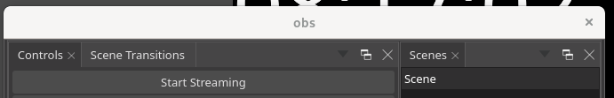
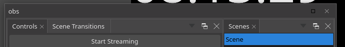
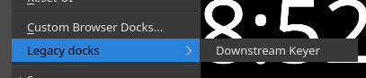

# Summary

- Switch main dock system to [ADS][1]
- Make ADS dock state per profile
- Allow the user to switch between pre-made layouts
  - Plugins could register their own
  - Users could save their own
- Dock added by plugins with the old methods are added as "*Legacy dock*"

Note: The "central widget" design is kept.

# Motivation

Provide a better dock system to end-users.

# Design
**DISCLAIMER**: The "central widget" design is kept, switching to a non-"central widget" one is not part of this RFC.

## Main window dock separation
To make OBS Studio compatible with ADS, Controls, Transitions, Mixer, Sources, Scenes docks need to be separated from the main window.

And the central widget of main window should also be separated as well to become the central dock.

So the docks will be separated as widget class with their own UI class.

Then those widget are inserted in OBSDock (QDockWidget) and the central widget and put as main window central widget.

And then we switch to ADS, all those widget will become docks and added to the ADS dock manager.

The OBSBasic heavily rely on some UI element from those docks, to resolve that the related code will be refactored to remove this dependance going toward a MVC pattern.

Each widget class will be put as a friend class in OBSBasic to allow access to private slot and avoid moving them as public.

### Controls widget
*Future ADS Controls dock widget*

All the buttons of this dock will be connected through signal and slots to OBSBasic.

Some hotkeys and pause functions rely on UI buttons, so OBS Basic will be refactored to remove this dependance.

### Transistions widget
*Future ADS Transitions dock widget*

Transitions will be stored in OBSBasic and selected through the combo box of the widget.

The transition duration will become an attribute of OBSBasic, and signal and slots will be setup to synchromise it with the dock spinbox.

Buttons for adding, removing and open settings will be connected through signals and slots to OBSBasic.

### Mixer widget
*Future ADS Mixer dock widget*

The base dock is easily separable, but the VolControl class can be refactored (toward MVC) later because this is not a requirement for this RFC.

### Sources widget
*Future ADS Sources dock widget*

OBSBasic heavily rely on the SourceTree from the widget, but a refactoring will not be considered as a requirement for this RFC. So the class of the sources widget will have OBSBasic as a friend class.

### Scenes widget
*Future ADS Scenes dock widget*

OBSBasic heavily rely on the SceneTree from the widget, but a refactoring will not be considered as a requirement for this RFC. So the class of the scenes widget will have OBSBasic as a friend class.

### Central widget
*Future ADS Central dock widget*

Some context bar, preview/program and nudge related code is moved to the central widget class.

This class will have OBSBasicPreview as a friend class.

This class will be a friend class of OBSBasic also to have access to some gs_vertbuffer_t type attributes.

## ADS
The Advanced Docking System, require to add a Dock Manager in the main window and then add the central widget and then add other docks.

Some work on themes CSS will be required.

### About obs-deps

obs-deps already build Qt for macOS and Windows, so adding a ADS script to the Qt tarballs is not a problem.

### Floating docks titlebar on X11
On X11, ADS provide two type of titlebar for floating docks:

- Native

[]()

- QWidget based (WIP CSS)

[]()

The QWidget one is used by default when using KWin based Desktop Environement like Plasma. And this titlebar requires some CSS in the themes to match it.

So the QWidget based titlebar usage will be enforced thanks to a flag for the Dock Manager to "unify" experience between desktop environement.
Theme makers may ignore to theme this bar.

### Dock state
*The per profile dock state feature is not taken into account to describe those changes.*

In the global config (`global.ini`).
- `"dockState"` is kept for for backward compatiblity and no longer overwitten. It will be used if the following state is not present.
- `"windowState"` is the state of the main window, since it does not store only the state of legacy docks.
- `"advDockState"` is the state of the dock manager which contain only the states of any ADS dock.

Service integrations only save `"advDockProfile"`

ADS dock state is compressed by default but behind the scene it's XML.

### OBSAdvDock
OBSAdvDock is a class which inherit `ads::CDockWidget` class.

This class has a constructor which require a QWidget and setup some things arround the widget and set some connections.

It adds a warning message when closing a dock from a close dock button.

It allows to reset a dock position after a UI reset or a layout change with a possibility to reset the size if set beforehand.

### Custom Browser docks and BrowserAdvDock
The custom browser docks feature is modified to use BrowserAdvDock which inherit OBSAdvDock.

Those docks are stored in the dock manager and their names is stored in a QStringList for browser docks to be able to get the dock from the manager to modify it like changing the URL.

Each of those browser dock is named `extraBrowser_$UUID` where `$UUID` is replaced by the dock UUID to have a really unique name.

### Service integration docks

Like custom browser docks, those integration are modified to use BrowserAdvDock. But their names is stored in the QStringList for plugins extra docks.

Those docks are named `obs-$SERVICE_$DOCK_NAME` where `$SERVICE` is the service name in lowercase and `$DOCK_NAME` the name of the dock.

`"dockState"` will be imported from the integration config if `"windowState"` is not present.

### Reset UI action
1. Legacy dock are hidden
2. The default state written in XML is applied
3. Each not shown OBSAdvDock/BrowserAdvDock dock have its position and size reseted.

## Legacy dock

**TODO: Talk about `obs_frontend_add_custom_qdock()`**

The frontend API method `obs_frontend_add_dock()` is put in deprecation. And if dual switch only Qt5 and on Qt 6 the method is removed or does nothing, this is possible because plugin will need to be rebuilt agaisnt Qt6.

And dock added through this method are added to a sub-menu named `Legacy dock` of the Dock menu.

[]()

When openning a legacy dock, a message will appear explaining that those docks will not meld wery well with "new" docks.

The state of those are saved through `"windowState"` global config.

## Per profile dock state
Move the `"advDockState"` from global config to the profile and integration no longer store their own state. `"windowState"` is kept global.

If a release happen between the switch to ADS and this feature, import the one from the integration service if the profile has one set up.

## Layouts management
Add the feature, to switch between registered/saved dock layouts:
- Though a sub-menu in the dock menu
- Through a hotkey
- Through the frontend API

OBS Studio could provide layouts, the default count as one.

Plugins could also register their own XML layouts through the frontend API.

Users could be able to save their own layouts. Those layouts will have their name prefixed with`user_` to avoid name conflicts.

Note: ADS perspective feature is not directly used because it relies heavily on QSettings.
## Frontend API

**TODO: Talk about obs_frontend_add_dock_by_id() that is now a thing**

This allow to add a OBSAdvDock with the given QWidget. Those docks are stored in the Dock Manager and their names is stored in the QStringList for plugins extra docks.

Default height and width would based on the widget actual size.

Minimum sizes used by the dock are based on the widget ones.

### Remove a dock

**TODO: Talk about `obs_frontend_remove_dock()` that is now a thing**

### Add a dock layouts

**TODO: Refactor API design**

```c++
#define obs_frontend_add_dock_layout(title, unique_name, xml_layout) \
	obs_frontend_add_module_dock_layout(obs_current_module(),    \
					 title, unique_name, xml_layout)
EXPORT void obs_frontend_add_module_dock_layout(obs_module_t *module,
					     const char *title,
					     const char *unique_name,
					     const char *xml_layout);
```

This allow the plugin to add a dock layouts in XML to the UI. ADS allow to test a layout (state/perspective) without applying it, so the layout will be tested before registering it.

### Get a list of docks layouts
```c++
EXPORT char **obs_frontend_get_dock_layouts(void);
```

This allow the plugin to get a list of registered dock layouts from the UI.

### Set a registered dock layout
```c++
EXPORT void obs_frontend_set_dock_layouts(const char *layout_name);
```

This allow the plugin to set a registered dock layouts to the UI, the asked name should come directly from the get list method.

### Remove a dock layouts

**TODO: Refactor API design**

```c++
#define obs_frontend_remove_dock_layout(unique_name) \
	obs_frontend_remove_module_dock_layout(obs_current_module(), \
			unique_name)
EXPORT void obs_frontend_remove_module_dock_layout(obs_module_t *module,
						const char *unique_name);
```

This allow the plugin to remove a dock layouts from the UI.

### Add a entirely custom dock

**TODO: Redo as those will be only legacy docks**

```c++
/* takes ads::CDockWidget */
#define obs_frontend_add_custom_dock(unique_name, dock)           \
	obs_frontend_add_module_custom_dock(obs_current_module(), \
						unique_name, dock)
EXPORT void obs_frontend_add_module_custom_dock(obs_module_t *module,
						    const char *unique_name,
						    void *dock);
```

Some plugin like [Sources Dock][6], do not add their docks to the Dock menu.

So this method allow to do this but requires the plugin to be link against ADS library.

And the dock will not have OBSAdvDock features.

Even if the plugin has the control over the dock, the the name is changed by the frontend API to be prefixed by the module name.

`obs_frontend_remove_dock()` can be used to remove the reference stored in the Dock Manager. Because their names is stored in the QStringList for plugins custom extra docks.

### Get the XML behind a registered dock layout
*Method meant to allow a Dock Layout editor tool to exist*

```c++
EXPORT char *obs_frontend_get_dock_layout(const char *layout_name);
```

This allow the plugin to get a registered dock layouts XML, the asked name should come directly from the get list method.

### Get the XML of the actual dock state
*Method meant to allow a Dock Layout editor tool to exist*

```c++
EXPORT char *obs_frontend_get_current_dock_state(void);
```

This allow the plugin to get the dock states XML of the UI.

### Events addition
- An event before the startup restore dock state and `OBS_FRONTEND_EVENT_FINISHED_LOADING` to allow plugins to load their docks before the restore or redo a restore if the number of extra docks has changed. This event could possibly be emitted when profile is changed before restoring profile dock state and `OBS_FRONTEND_EVENT_PROFILE_CHANGED`.

- An event when the a dock layout is applied (reset or not) to allow plugins to reset the positions of their customs docks, if they want to.

## About making dock states future proof
By default generated state are version 0. If one day we make a breaking change like remove the notion of central widget and so change the version.

We could take the saved `"advDockState"` and uncompress to edit the XML, to make it compatible with the change.

# Drawbacks
We can't convert old `"dockState"` to the new dock system.

# Additional Information
About Wayland support, Qt and ADS docking system have very bad support because of Qt Wayland. The Wayland backend is apparently third-class on Qt's priorities.

My WIP branches:
- [Dock separation][2]
- [Central widget separation][8]
- [Switch to ADS][3]
- [Frontend API to add ADS dock][4]
- [Frontend API to add custom ADS dock][5]

[1]: https://github.com/githubuser0xFFFF/Qt-Advanced-Docking-System
[2]: https://github.com/tytan652/obs-studio/tree/dock_separation
[3]: https://github.com/tytan652/obs-studio/tree/advanced_docking
[4]: https://github.com/tytan652/obs-studio/tree/ads_frontend_api
[5]: https://github.com/tytan652/obs-studio/tree/add_custom_dock
[6]: https://obsproject.com/forum/resources/source-dock.1317/
[7]: https://doc.qt.io/qt-5/qobject.html#setProperty
[8]: https://github.com/tytan652/obs-studio/tree/central_widget_separation