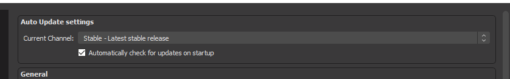

# Summary

Changes to add the option for Windows users to opt into branches containing unstable/beta releases.

# Motivation

Currently, Betas/RCs only reach a small number of users and require manual download and installation (outside of Steam).

Additionally, we may also occasionally provide branches to test specific fixes without releasing a full Beta/RC or manually sending builds to users.

# Changes

## Server-side

To make branches accessible, a new file would be added next to the existing `manifest.json`, called `branches.json`, the content of the file would describe available branches.

Example:
```json
[
  {
    "default": true,
    "description": "Latest stable release",
    "display_name": "Stable",
    "enabled": true,
    "manifest": "manifest.json",
    "name": "release"
  },
  {
    "default": false,
    "description": "Latest Beta or Release Candidate",
    "display_name": "Beta / Release Candidate",
    "enabled": false,
    "manifest": "manifest_beta.json",
    "name": "beta"
  },
  {
    "default": false,
    "description": "Unsigned nightly builds",
    "display_name": "Nightly",
    "enabled": true,
    "manifest": "manifest_nightly.json",
    "name": "nightly"
  }
]
```

The purpose of the `enabled` flag here is to steer clients away from a branch, without deleting it from the list entirely.  
For example, a user who opted into receiving release candidate builds would still see the option selected in the user interface, but OBS would fall back to the `default` branch if the branch is not currently enabled.

Additionally, we may consider a `visible` flag to provide hidden branches that can only be selected via config or manual name entry, for example when providing builds with targeted fixes to a smaller number of users.

For current and new builds to co-exist on the server the file structure may have to be changed slightly.
- **Current:** `https://cdn-fastly.obsproject.com/update_studio/<package>/<file path>`
- **Proposed:** `https://cdn-fastly.obsproject.com/update_studio/<branch>/<package>/<file path>`

The URLs for delta patches may be retained since they already allow for multiple patch files for one target file, differentiated by source hash.

## UI

### Visual

Add a new section with a dropdown to switch the update "channel". The dropdown shows the name and description of the branch.  
After applying a change in branch, closing the settings window will trigger a check for updates on the selected branch (if enabled).



(In this example the "enable auto-updates" checkbox was also moved into the new group)

### Code

- Before fetching the `manifest.json` the UI would also need to request `branches.json` and then decide which manifest file to fetch.
- In case the selected branch is disabled, it should fall back to the default "stable" branch
- The selected branch needs to be added to the command line arguments used for the updater

## Updater

The selected branch would be passed as the first argument to the updater and used when constructing the download URL. No further changes should be required.

# Drawbacks

- Due to how the current updating process works this process still requires manually signed and uploaded builds. So nightlies straight from CI are not an option without further changes.
- Users may opt into updates without fully understanding the impact, and run into issues when presented with a Beta/RC build.

# Additional Information

While this RFC only covers Windows, similar changes should be possible for macOS by changing the URL of the Sparkle feed that is consumed by the updater.
