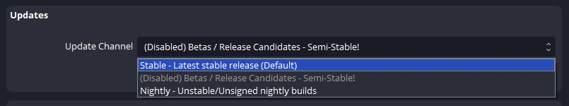

# Summary

Changes to add the option for Windows users to opt into branches containing unstable/beta releases.

# Motivation

Currently, Betas/RCs only reach a small number of users and require manual download and installation (outside of Steam).

Additionally, we may also occasionally provide branches to test specific fixes without releasing a full Beta/RC or manually sending builds to users.

# Changes

## Server-side

To make branches accessible, a new file would be added next to the existing `manifest.json`, called `branches.json`, the content of the file would describe available branches.

Example:
```json
[
  {
    "name": "beta",
    "display_name": "Beta / Release Candidates",
    "description": "Semi-stable test builds",
    "enabled": false,
    "visible": true,
    "macos": true,
    "windows": true
  },
  {
    "name": "nightly",
    "display_name": "Nightly",
    "description": "Unstable/Unsigned nightly builds",
    "enabled": true,
    "visible": true,
    "macos": false,
    "windows": true
  },
  {
    "name": "test_1234",
    "display_name": "Test, Issue #1234",
    "description": "Test Build to Fix issue #1234",
    "enabled": true,
    "visible": false,
    "macos": false,
    "windows": true
  }
]
```

The display name of a branch may be any valid UTF-8 character sequence. The `name` property shall only use lowercase ascii characters a-z, 0-9, and "_".

The name of the manifest file for a branch would be constructed as `manifest_{name}.json` and expected to be in the same location as the default manifest.
The default branch ("stable") must not be specified and is hardcoded to be always present.

The purpose of the `enabled` flag here is to steer clients away from a branch, without deleting it from the list entirely.  
For example, a user who opted into receiving release candidate builds would receive builds from the default branch while the RC branch is disabled, but would then again receive release candidate builds once the branch has been re-enabled. In the UI this could be represented by a note in the dropdown such as "<Branch Name> *(Disabled, using default branch)*".  
If a selected branch is deleted entirely, OBS should fall back to the default branch, notifying the user via a simple dialog box.

Additionally, we may consider using the `visible` flag to provide hidden branches that can only be selected via config or manual name entry, for example when providing builds with targeted fixes to a larger number of users without manually distributing test builds.

For patches and binaries of several branches to co-exist on the server the file structure may have to be changed slightly:

Update files:
- **Current:** `https://cdn-fastly.obsproject.com/update_studio/<package>/<file path>`
- **Proposed:** `https://cdn-fastly.obsproject.com/update_studio/<branch>/<package>/<file path>`

Delta patch files:
- **Current:** `https://cdn-fastly.obsproject.com/patches_studio/<package>/<file path>/<source hash>`
- **Proposed:** `https://cdn-fastly.obsproject.com/patches_studio/<branch>/<package>/<file path>/<source hash>`

## UI

### Visual

Add a new section with a dropdown to switch the update "channel". The dropdown shows the name and description of the branch.  
After applying a change in branch, closing the settings window will trigger a check for updates on the selected branch (if enabled).



### Code

- (Windows) Before fetching the `manifest.json` the UI would also need to request `branches.json` and then decide which manifest file to fetch
- (macOS) Branches will need to be fetched and validated before starting Sparkle's update check
- In case the selected branch is disabled, it should fall back to the default branch
- The selected branch needs to be added to the command line arguments used for the updater
- The available branches are kept track of inside `OBSApp` so they can be accessed via `App()->GetUpdateBranches()`

## Updater (Windows)

The selected branch would be passed as an argument to the updater and used when constructing the download URL. Additionally the branch will be included as a URL parameter when requesting a list of delta patches from the server.

## Sparkle (macOS)

In Sparkle 2 we can add a channel to each appcast item via `<sparkle:channel>beta</sparkle:channel>` and then set the currently opted-in channel via `allowedChannelsForUpdater`.

To prevent issues with older Sparkle versions we may have to use a separate RSS feed from the current ones. In doing so we could merge feeds for Apple Silicon and Intel builds and use channels to differentiate them, e.g. use `<branch>_(arm64|amd64)` as the channel name.

# Drawbacks

- Due to how the current updating process works this process still requires manually signed and uploaded builds. So nightlies straight from CI are not an option without further changes.
- Users may opt into updates without fully understanding the impact, and run into issues when presented with a Beta/RC build.
- (Windows) Rolling back to an older release may leave the OBS directory in an "unclean" state with future plugins/libraries not removed
  + This could be partially mitigated by https://github.com/obsproject/obs-studio/pull/6916

# Additional Information

- Sparkle documentation: https://sparkle-project.org/documentation/api-reference/Protocols/SPUUpdaterDelegate.html
- Pull Request (Windows): https://github.com/obsproject/obs-studio/pull/6907
- Pull Request (macOS): https://github.com/obsproject/obs-studio/pull/7723
