# Summary

Redesign the properties window and view to suit smaller screens.

This proposal comes in three parts:

1. Make the OBSBasicProperties layout horizontal and fix the contained OBSPropertiesView width to 300px
2. Update the OBSPropertiesView layout so that widgets are smaller and laid out more space-efficiently to fit within the 300px

# Motivation

It is, and always has been, my belief that OBSBasicProperties does not make efficient use of screen real estate, particularly on smaller displays. To my mind, this comes down to the vertical layout of the window. The issues are:

- to display the source preview at a reasonable size, the window must be fairly large **or** the splitter must be dragged down, thus showing few property widgets. This leaves laptop users with two choices:
  - small preview with a lot of property widgets
  - reasonable preview with few property widgets
- to display the source preview at a reasonable *width*, the window must be fairly wide. This elongates the property widgets — in most cases, they don't need to be that long

# Prior art

I was inspired by the following user interfaces, from pro video applications to productivity applications.

Narrow properties views, also called inspectors, are not uncommon. Apple (in its pro and productivity apps) and Adobe make good use of them, most software development IDEs have some kind of inspector layout.

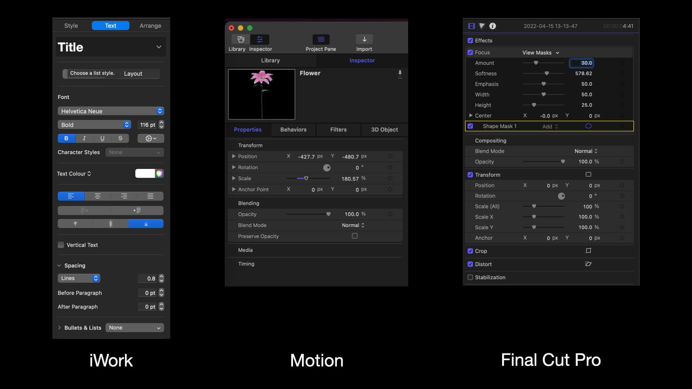

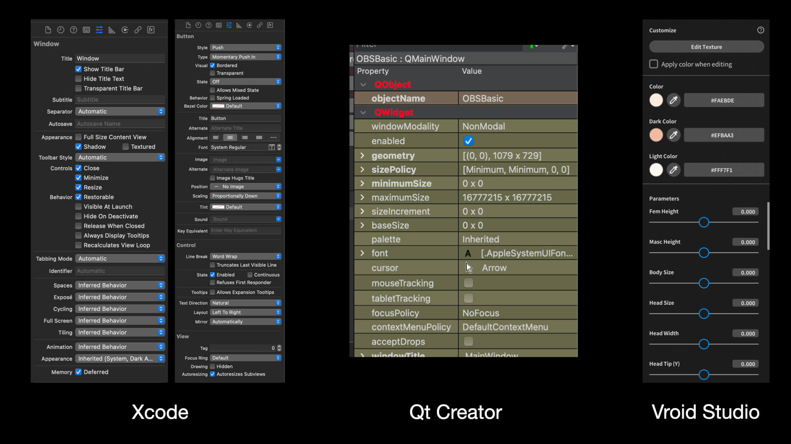

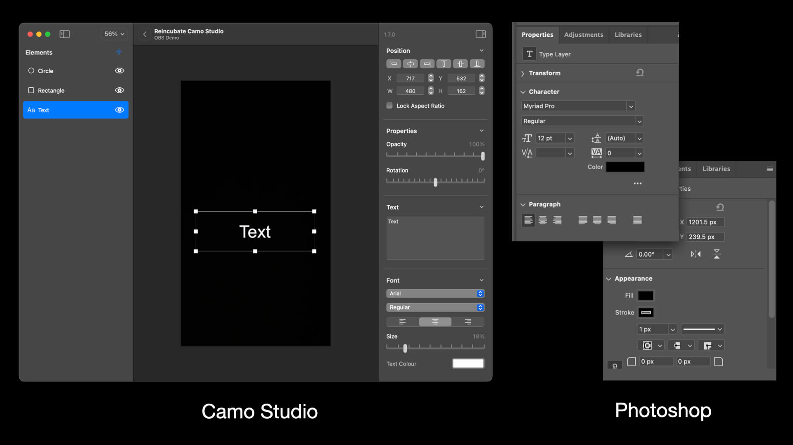

# Design

## Make the Properties window layout horizontal

The motivation here is to make better use of the window's real estate.

At a given size, preview at the left and OBSPropertiesView at the right, there *should* be more property widgets be visible than in the current layout.

Also, the OBSBasicProperties should be fixed in width to around 300px (or some similar, narrow width; subject to testing). This means:

- the layout is easier to use than using a splitter whilst solving the issue that the splitter was intended to resolve
  - the size of the preview is contingent on the window size, not window size **and** splitter
- this design lends the Properties view to being repurposable as a dock in future

## Update the OBSPropertiesView layout

To accommodate OBSPropertiesView being located on the side within a fixed width view, OBSPropertiesView widgets should be made smaller and laid out more efficiently to make best use of the new, narrower space. The most straight-forward way to do this is to use a smaller font size.

Further, the OBSPropertiesView currently uses a QFormLayout to manage all of the widgets. This makes all labels for each widget the same width as the longest label. This is a wasteful use of horizontal screen real estate:

- if only one label is very long, *every* label becomes long, wasting horizontal space
- in the current vertical layout, some labels require the Properties window to be *very* wide in order to accommodate both the label and the widget
- in the horizontal layout, the Properties view would be so wide as to defeat the purpose of the change

Instead of using a QFormLayout, I propose a QVBoxLayout. This would change the layout from:

```
     Label: [     Widget     ]
Long label: [     Widget     ]
```
to
```
Label:
[     Widget     ]
Long label:
[     Widget     ]
```

## Adapt widgets for the narrow layout

Some widgets could further be adapted. For example:

- buttons with consistent text (Pick Color, Open File, etc.) could be reduced to a button with a glyph
  - these smaller buttons could be placed in-line with the label.
- superfluous or unnecessary labels could be reworded, restyled, or removed
- the Pick Color button in particular could be changed to simulate a color well (such as on web browsers with the ``<input type='color'>`` tag or macOS' NSColorWell control)

For example, the color picker could be changed so that:

1. the color code label is removed
2. the Pick Color button's text is removed
3. the Pick Color button's background color is changed to match the selected color

```
Color #1:
[     #ffffff     ] [Pick Color]
Color #2:
[     #ffffff     ] [Pick Color]
```
to the more space-saving
```
Color #1:    [   ]
Color #2:    [   ]
```

## Accessory widgets for the narrow layout

Next, I propose the concept of an accessory widget. Currently, properties can display a label and a widget. Under the proposed layout, that gives two orientations for displayng properties: vertical and horizontal. However, it can be useful to display a widget next to the label **and** a larger widget beneath.

For this, I propose an accessory widget — this is displayed to the side of the label only if it is initialized.

For example, a number property with a slider could be changed so that:

```
Number label: -----v----- [   5]
```
is more efficiently laid out as:
```
Number label: [   5]
----------v---------
```

This affords more space for the slider.

In the wide layout, this change is unnecessary and displays as a standard QFormLayout row.

## Display OBS_PROPERTY_BOOL using a label and accessory in the narrow layout

For a more consistent layout, with labels at the left and widgets at the right, I propose not showing OBS_PROPERTY_BOOL as a QCheckBox (checkbox then label) but as a label and QCheckBox accessory (label - space - checkbox) for consistency with every other widget.

Instead of:

```
Some button   [ OK ]
[x] Some check box
```
show:
```
Some button   [ OK ]
Some check box   [x]
```

This layout is inspired by Motion, see [prior art](#prior-art).

In the wide layout, this change is unnecessary and displays as a standard QCheckBox.


## Don't use checkable QGroupBox in the narrow layout

For consistency with the check boxes above, instead of using checkable QGroupBoxes, I propose to display the group box name in a label and a checkbox in an accessory.

Instead of:

```
._[x]_Group_name_____.
|                    |
|____________________|
```
show:
```
Group name         [x]
.____________________.
|                    |
|____________________|
```

Although this adds a bit of height, it makes the group box name stand out more clearly, and in my code I have added a spacer above the group name to help each group appear separated from the one above it.

# Examples

Please note: these screenshots come from a WIP state where I have merged Properties and Filters into a single interface. I will propose this in a separate RFC.

## Audio sources

Note: since audio captures have no preview, it is hidden and the window is made to fit the only remaining contents, the OBSPropertiesView. This is a hint at what OBSBasicProperties could look like as a dock.

| | |
| :-: | :-: |
| 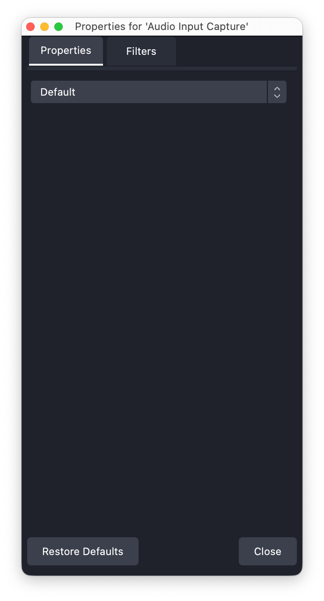 | 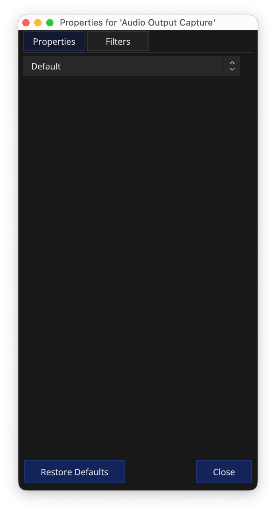 |

## Browser source

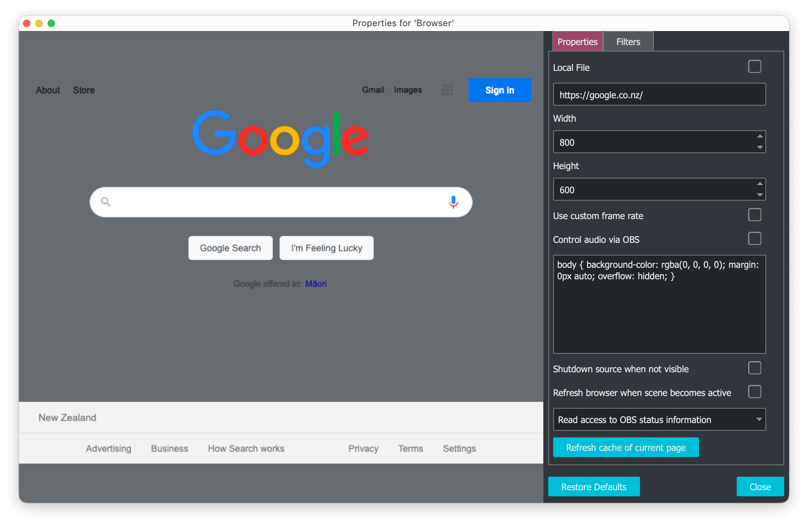

## Color source

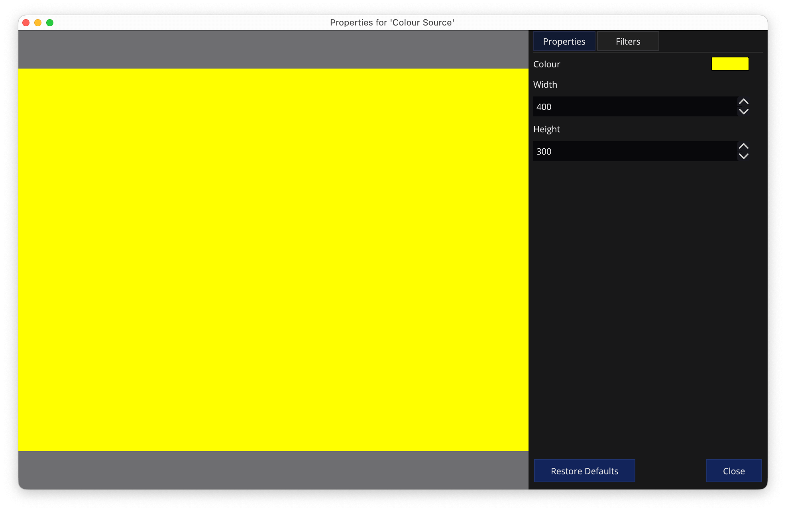

## Image source

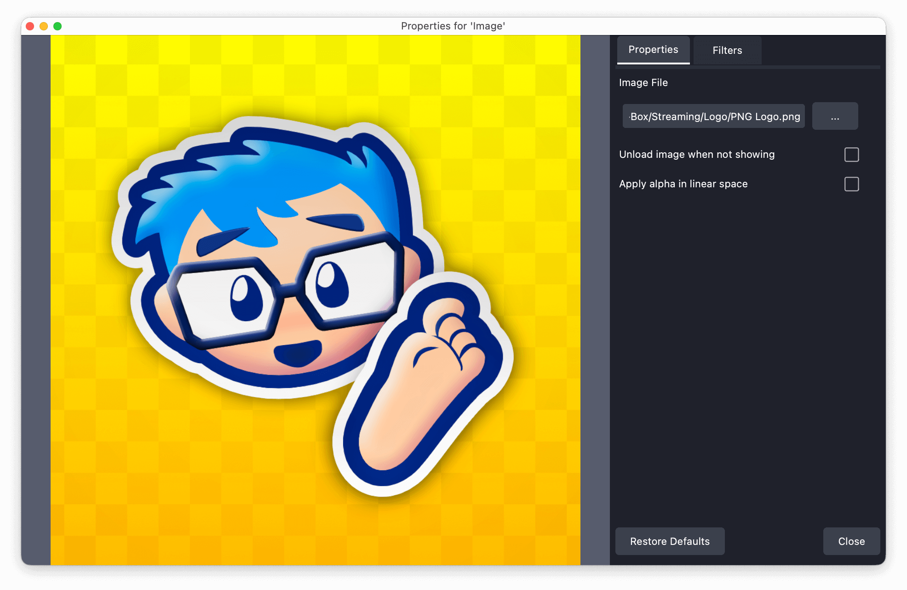

## Image slideshow source

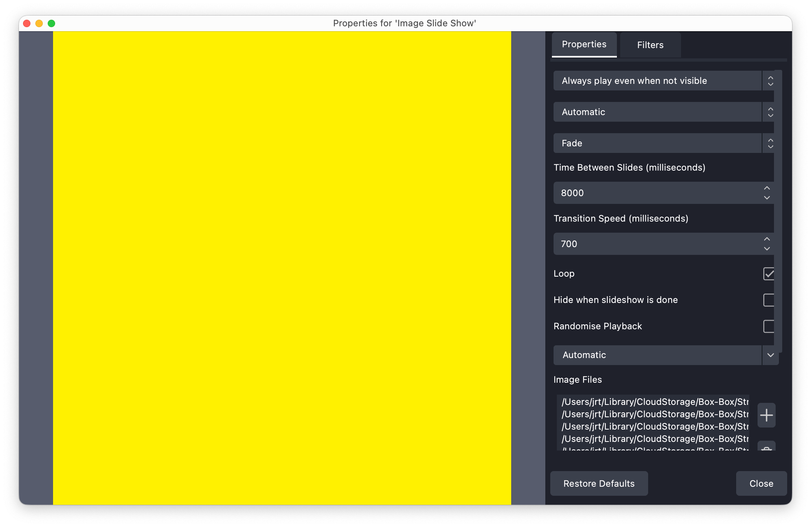

## Media source

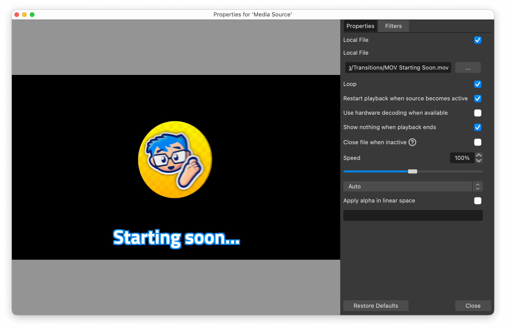

## Text source

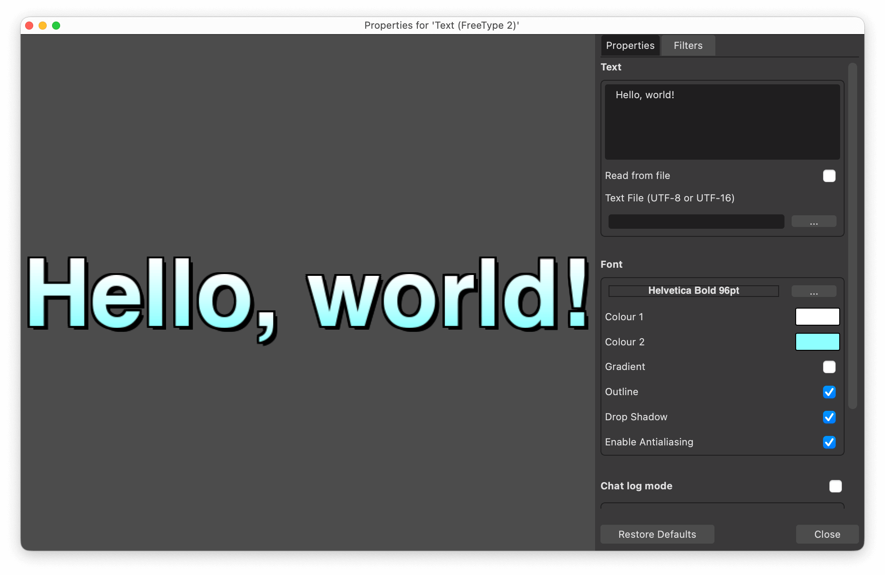

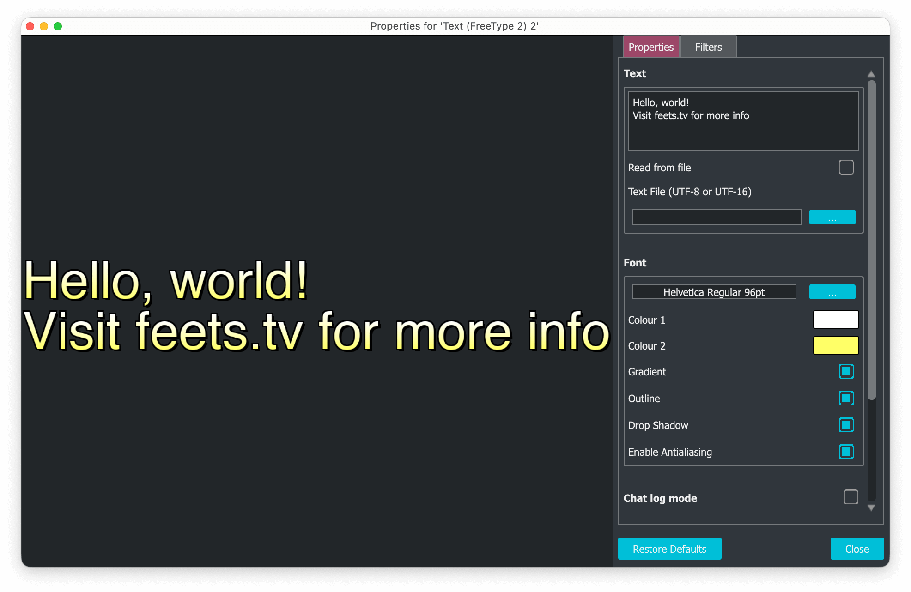

## Video capture source

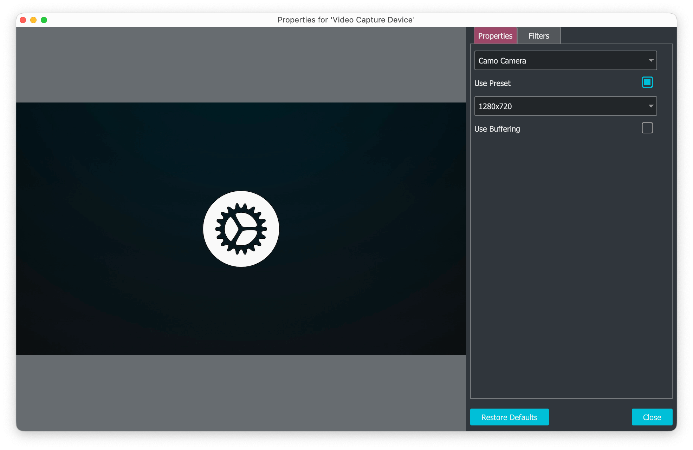

## Effect filter

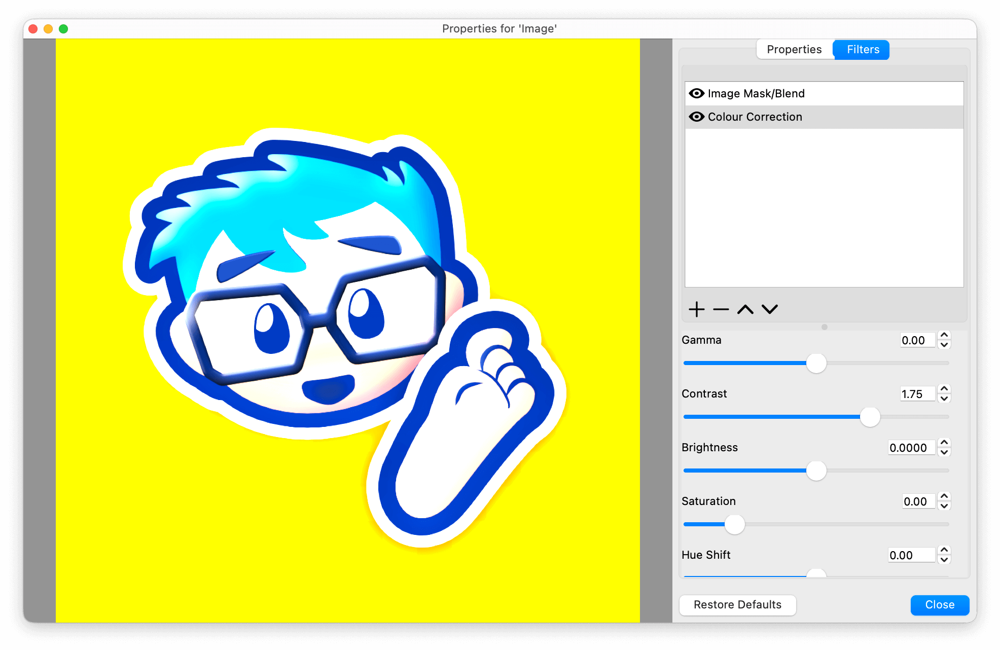

## Async filter

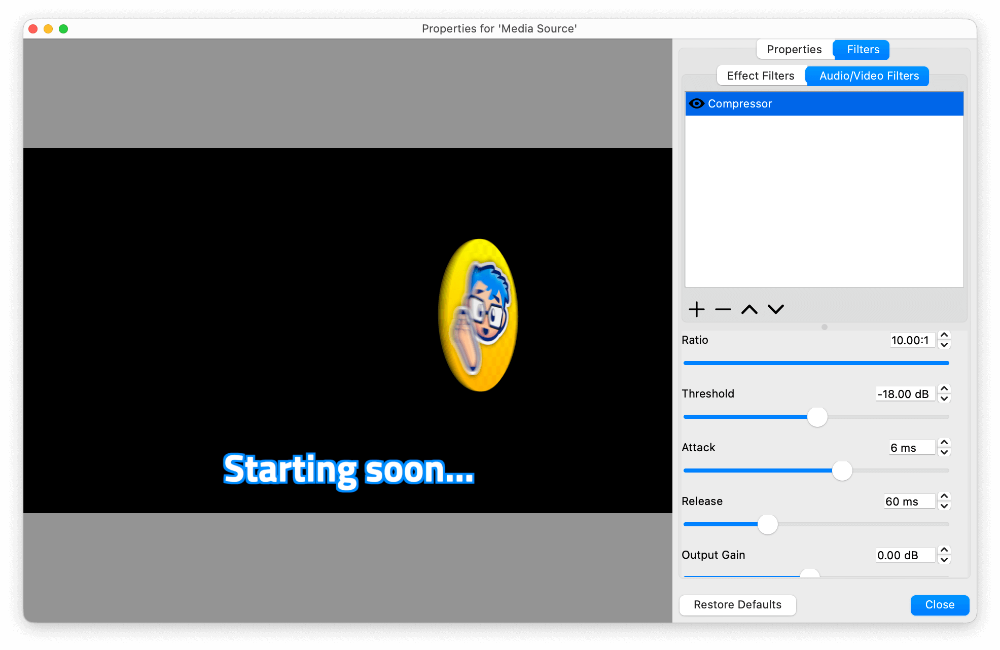

## Transition

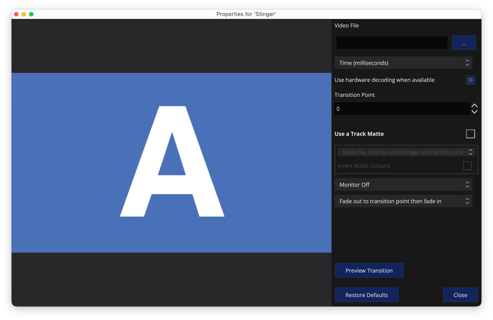

## Wide layout

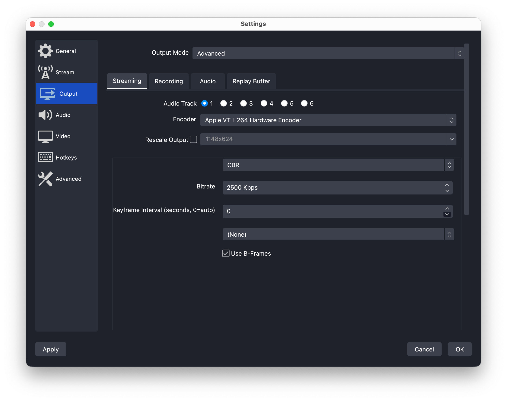

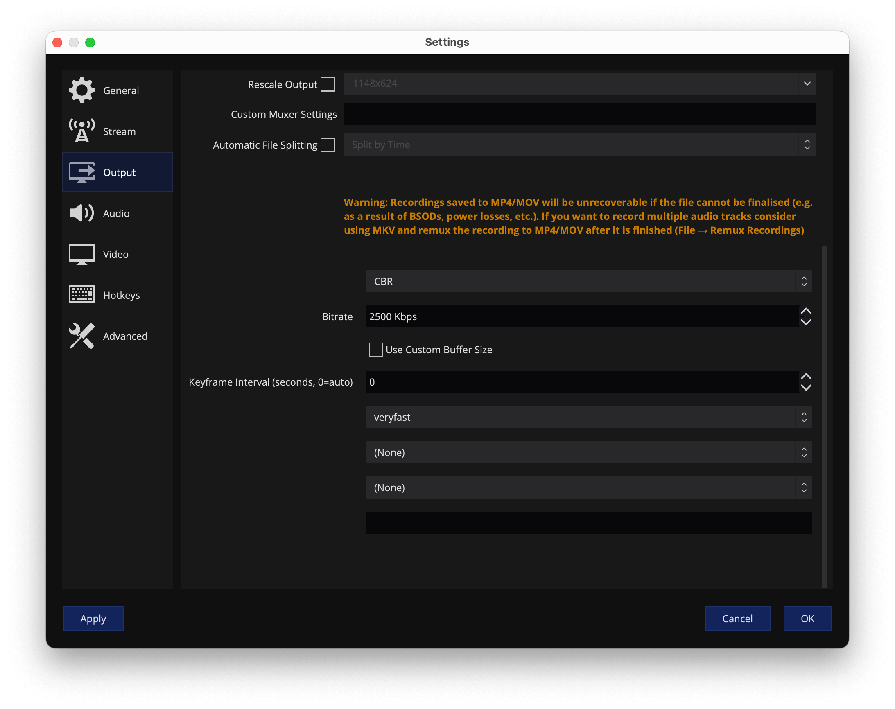

# Drawbacks

From a design point of view, for this change to have any meaningful impact on the number of properties controls visible on screen at any given time, the following concessions must be made:

- the font size must be reduced across the board to a consistently small-but-legible size
  - this may harm accessibility
  - that said, many of the included themes use 10pt or 11pt as a "small" size for certain controls
  - in my code, I have chosen 11pt
- the OBSPropertiesView is re-used by OBSBasicSettings to display certain controls which do not require a narrow layout
  - to accommodate this, a new member (``wideLayout``) has been added OBSPropertiesView
    - if ``wideLayout`` is true, property widgets are displayed in their current, QFormLayout-based behaviour
    - if ``wideLayout`` is false, property widgets are displayed in a QVBoxLayout with a consistent label-at-left-control-at-right-or-beneath paradigm
  - this has the effect of making OBSBasicSettings slightly more complicated due to handling two different types of display
- fixing the width of OBSPropertiesView contained within OBSBasicProperties to 300px
  - this is a lot more opinionated than simply rotating the QSplitter to be horizontal
  - in certain languages, labels' translatable text may be too long to display properly
  - however, I believe the benefit of more efficiently-used screen space is worth the trade-off
- non-standard checkbox placement could be confusing
  - I think most users will be familiar with the paradigm of controls on the right through exposure to mobile layouts where this is standard
  - the aim of this change is internal consistency with other property widgets
  - it also makes the narrow layout more attractive

# Additional Information

Any additional information that may not be covered above that you feel is relevant. External links, references, examples, etc.
