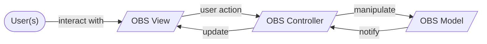
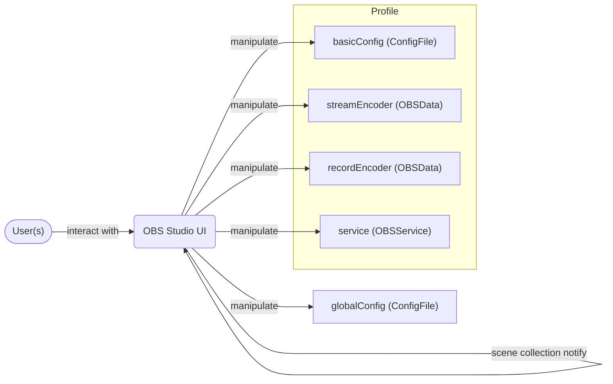
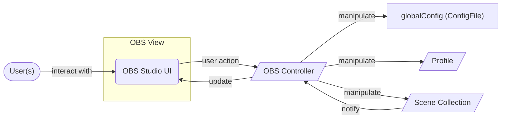
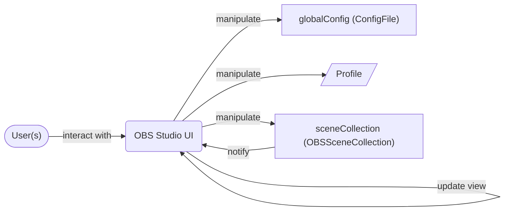
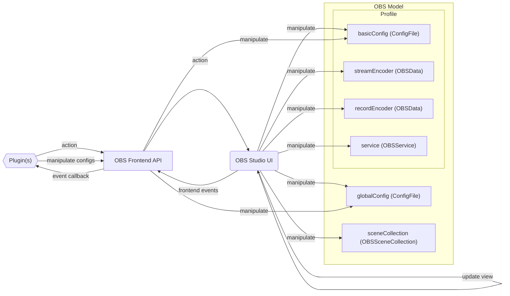
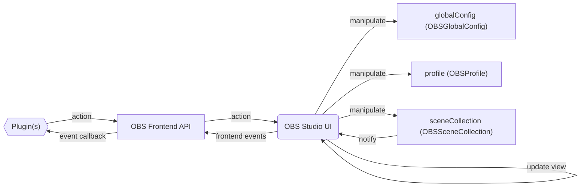
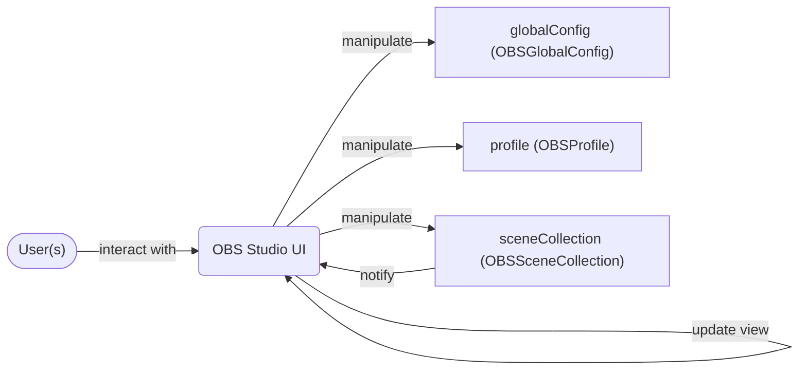
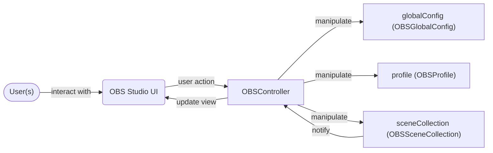
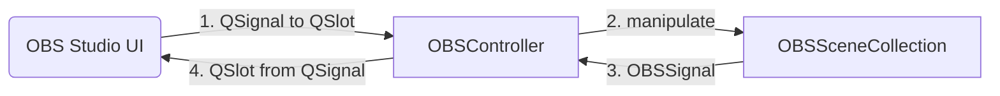

# Summary

- Apply the MVC pattern
- Global config, profile and scene collections are represented by their own object
- Frontend API functions related to config file are replaced

# Motivation

The actual code is almost a chimera of software architectural patterns, applying the MVC pattern will allow to untangle the code and make it more clear.

# Design

**The naming of new types is not final.**

Flowchart diagrams will be used as illustration so the following is the key for those:
- Parallelogram nodes represent concepts/abstraction.
- Rectangle nodes represent a piece of software (code, classes, API…).
  - If with round edges, a user can see it and/or interract with it.
<!-- Hexagon nodes represent plugins-->

This is a diagram representing basic MVC:

---

The following is the same diagram but considering splitting the model in three like it is in OBS Studio (global, profile, scene collection):
 ```mermaid
flowchart LR
    user(["User(s)"])
    view[/OBS View/]
    controller[/OBS Controller/]

    globconf[/Global Config/]
    profile[/Profile/]
    scenecol[/Scene Collection/]

    user-- "interact with" -->view
    view-- "user action" -->controller
    controller-- "update" -->view

    controller-- manipulate -->globconf
    controller-- manipulate -->profile
    controller-- manipulate -->scenecol
    scenecol-- notify -->controller
    
```
---

If those concept are replaced by their matching elements in the actual OBS Studio (without considering the frontend API), it looks like that:


"*OBS Studio UI*" combines "*OBS View*", "*OBS Controller*" and "*Scene Collection*" which is a part of the "*OBS Model*".
Note that ConfigFile is not a good type to represent *globalConfig* and *basicConfig*.

"*Profile*" is also splitted into three or four parts (*recordEncoder* is unused if the encode is the same as the stream), so this one really need a type to represent it.

Note: from now, the node "*Profile*" will be used if the diagram is not related to "*Profile*" itself.

---

So by applying MVC, "*OBS Studio UI*" should only serve as "*OBS View*":


## "*Scene Collection*" and "*OBS Studio UI*"

The "*Scene Collection*" contains everything related to scenes, sources (and filters) are tightly connected to them:
- Transitions
- Projectors
- Scaling of the preview
- Video mix configuration for the virtual camera
- Settings of some plugins bound to the collection

Except the last point, everything is stored in parts of the UI. "*Scene Collection*" shall be split from it into a new type/object.



The changes around the "*notify*" part are explained later.

## "*Profile*" and "*Global Config*"

New types/objects will be created to represent those:


Note: *OBSProfile* also includes encoders and service.

Their ConfigFile could be openned only when loading and saving but…

### "*OBS Frontend API*" and ConfigFile

"*OBS Frontend API*" provide functions to access *globalConfig* and *basicConfig* (profile) and modify them without restriction ignoring "*OBS Controller*", the program is not even aware is one of its own config happen to be changed.



So `obs_frontend_get_global_config` and `obs_frontend_get_profile_config` will be deprecated.

Until those are removed, OBSGlobalConfig or OBSProfile will open the ConfigFile and keep it updated. But changing a OBS config from a plugin will have no effect, the stored value will overwrite what the plugin has put.

To replace those two functions to allow plugins to save their config in the global config or the profile. Functions like the following will be created for `bool`, `double`, `int64_t`, `uint64_t` and `const char *`(string):

```c
EXPORT void obs_frontend_set_global_bool_config(const char *section, const char *name, bool value);

EXPORT bool obs_frontend_get_global_bool_config(const char *section, const char *name);
```

```c
EXPORT void obs_frontend_set_profile_bool_config(const char *section, const char *name, bool value);

EXPORT bool obs_frontend_get_profile_module_bool_config(const char *section, const char *name);
```

If a section owned by OBS is used with a setter, the setter will do nothing.

Those settings will be stored in OBSGlobalConfig or OBSProfile, and then written in the file while saving.

To check if functions to get some OBS config is needed, asking third-party plugins developper may be needed.

Now "*OBS Frontend API*" no longer bypass "*OBS Controller*" to manipulate the global config and the profile:



## "*OBS Controller*" and "*OBS Studio UI*"

"*OBS Studio UI*" act as "*OBS View*" and "*OBS Controller*". "*OBS Controller*" is scattered in various elements of the UI.


---

*OBS Controller* shall be split from the UI:



Other windows (e.g. settings) will parented to the main window but will be created from "*OBSController*".

---

Note that OBSController will manage all OBSSignal and bound them to a Qt signal/slot meant for the UI, no OBSSignal will be directly bound to an UI element.



### "*OBS Frontend API*" and MVC (WIP)

The OBS Frontend API worst defect is that it exposes private objects pointers (main window, systray).

Note: Drop = "Deprecation and then drop (no replacement)"

- Drop obs_frontend_get_main_window
- Drop obs_frontend_get_main_window_handle
- Drop obs_frontend_get_system_tray
- Drop custom QDockWidget related function
- Create functions to replace dropped functions usecases without directly exposing the main window pointer/handle same for the systray

Potentially split the API in two APIs (controller and view)

# Additional Information

The frontend API is the only part of OBS Studio that have access to "*OBS View*" (dock, action…), "*OBS Controller*" and "*OBS Model*" (sources, scenes…).

The "OBSBasic" naming could retired from while progressing on the application of this RFC.
