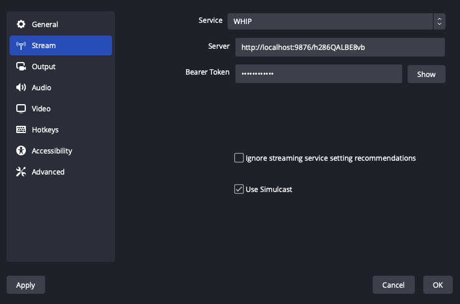

# Summary

Add Simulcast support to WebRTC output.

Simulcast is a WebRTC protocol feature that allows a uploader to send layers of one track. This is built into the protocol so every WebRTC
ingest already understands this. These layers can be different resolutions, bitrates and even codecs.

# Motivation

Live streaming services offer videos at multiple bitrates and resolutions. This is needed to support the wide variety of connections that users will have.
Today streaming services decode the incoming video, modify and then re-encode to generate these different quality levels. This has some draw backs that Simulcast
will fix or improve.

* **Generation Loss** - Decoding and re-encoding videos causes generation loss. Simulcast means encodes come from the source video which will be higher quality.

* **Higher Quality Encodes** - Streamers with dedicated hardware can provide higher quality encodes. Streaming services at scale are optimizing for cost.

* **Lower Latency** - Removing the additional encoding/decoding allows video to be delivered to users faster.

* **Reduce server complexity** - Users find it difficult to setup RTMP->HLS with transcodes. With Simulcast setting up a streaming server becomes dramatically easier.

# Design

## When WHIP is selected service provide a 'Use Simulcast' checkbox

When users select `WHIP` for their service a checkbox will appear below `Ignore streaming service setting recommendiations`.

This checkbox will say `Use Simulcast`. This will be unchecked by default.

## Create multiple encoders with the requested settings.

A new member will be added to the `BasicOutputHandler` class. This new member `std::vector<OBSEncoder> simulcastEncoders` will contain
the encoders.

`BasicOutputHandler` will query if `UseSimulcast` is enabled. If enabled it will create two additional encoders `simulcast_0` and `simulcast_1`.
The three encoders will be like the following.

* `simple_video_stream` - Full Resolution, Full Bitrate
* `simulcast_0` 50% Resolution of `simple_video_stream`, 50% bitrate of `simple_video_stream`
* `simulcast_0` 25% Resolution of `simple_video_stream`, 25% bitrate of `simple_video_stream`

## Configure PeerConnection in `obs_output_info.start`

`WHIPOutput::Start` will use `obs_output_get_video_encoder2` to query how many encoders exist.

If 3 encoders exist we will enable Simulcast and the layers will have RIDs of `h` (high), `m` (medium) and `l` (low).
RIDs are used in the WebRTC protocol to give labels to a stream of video.

# Proposed UX

## Stream Page

When users select `WHIP` for their service a checkbox will appear below `Ignore streaming service setting recommendiations`.

This checkbox will say `Use Simulcast`. This will be unchecked by default.

## Simple Output Mode

No changes will be made.

## Advanced Output Mode

No changes will be made.

# Alternatives

## Do not implement Simulcast

We could require users to install additional software to use Simulcast.

## Advanced UIs

This would require a large amount of UI work. I also wasn't able to find agreement on how this should work among the WebRTC service providers.
The simple mode I was able to find consensus quickly.

# Drawbacks

## Additional Complexity

Simulcast will add additional code to the OBS code base. If this feature is unused it would be extra burden on the project for no value.

## More Compute/Network Usage

Simulcast will require extra compute and network. If users encounter hardware/network overusage they will need to reduce bitrate/resolution.

In the future I would like to write a dynamic simulcast feature. The WebRTC protocol allows layers to be disabled/enabled at anytime. We could detect network
overusage and disable layers to ensure the streamer has the best experience possible. We would then re-enable them when the network and/or hardware recovers.

I develop and use OBS on a T420 (a laptop from 2011). When streaming using WebRTC and using x264 I see ~6% CPU usage in OBS. With Simulcast enabled I see ~8%. I can gather
more fine performance information if that helps.

# Additional Information

Implementation:
* [PR](https://github.com/obsproject/obs-studio/pull/9165)
